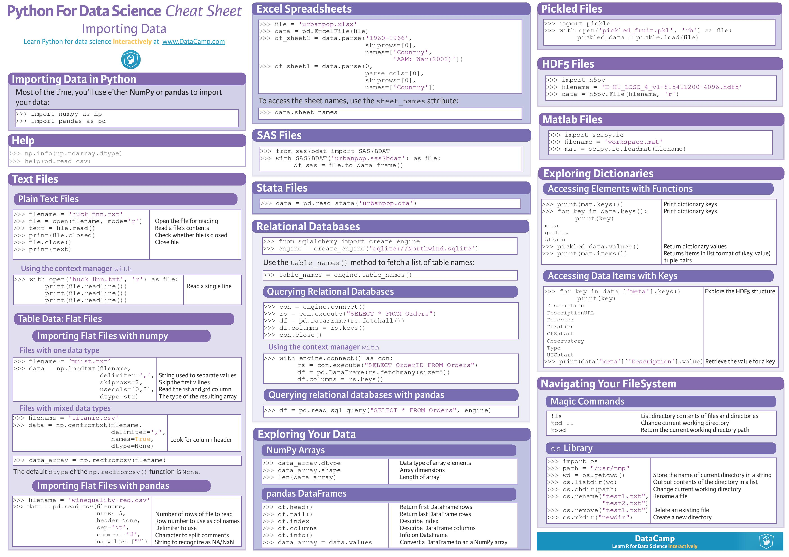
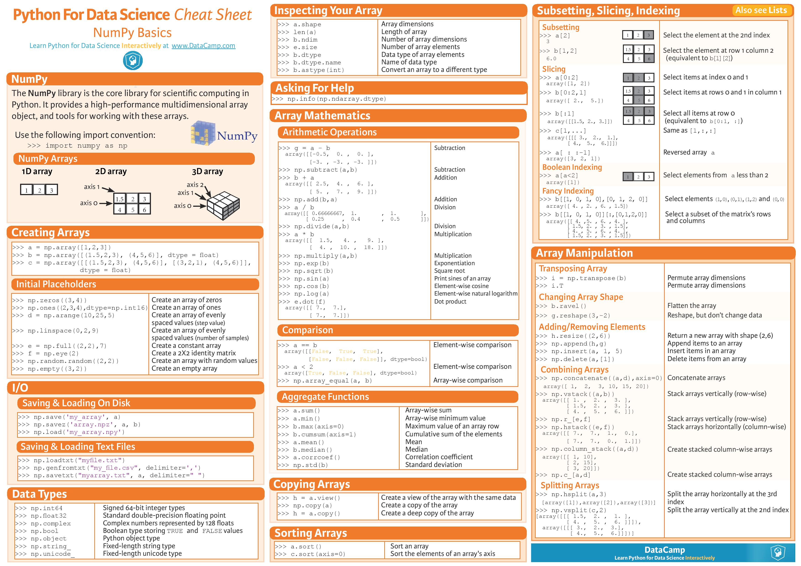
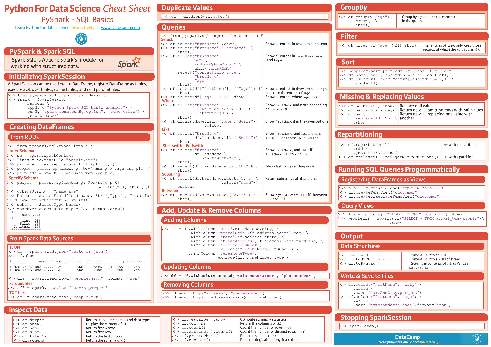
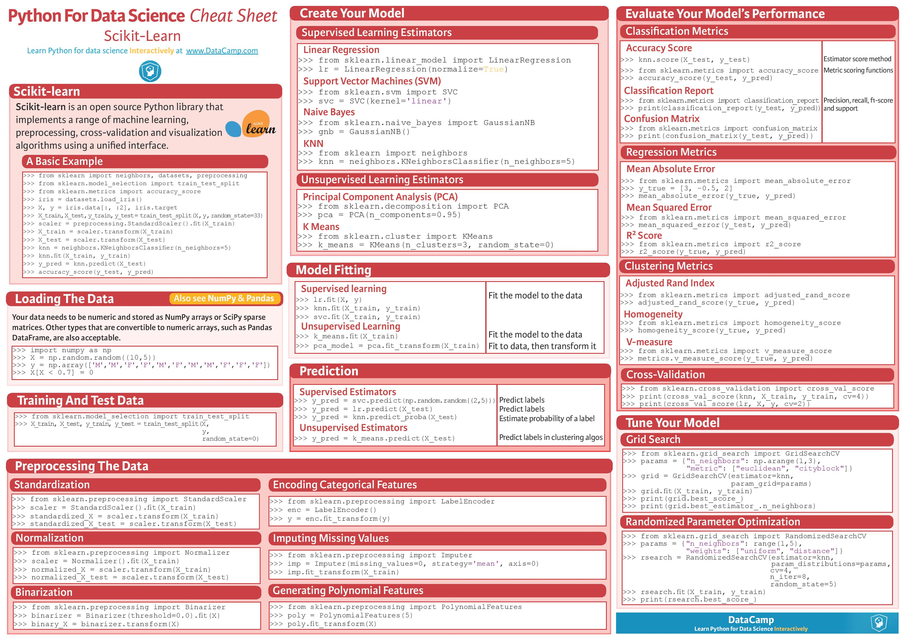
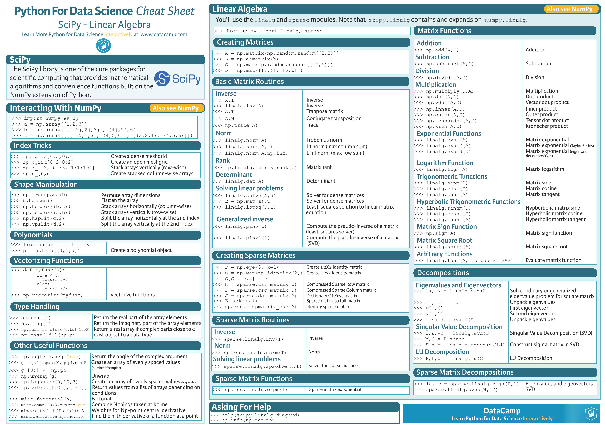

# My Deep Learning Resources

This README is how and where I learn deep learning from the internet. There are many resources out there and normally you could just google it, but I kept the resources that I like or suggest here. I'll constantly update the list here, since I am constantly learning.

## A suggested approach for learning

Learning is a long path of work. When I am learning deep learning, sometimes I just couldn't understand some terminology. The strategy to tackle this problem is to read more regarding to the same topic. Some articles assume you know the knowledge (unfortunately, you are not), and skip the details of it. Therefore I would suggest to read more until you understand it. This approach is somehow similar to the training in supervised learning. More data you feed in the training, better performance you'll attain. The resources listed below have some overlap knowledge, so read fast the part you already know and deep into the one you don't. Enjoy!

## Table of Content

- [CNN Paper]()

- [RNN Paper]()

## Post

## Github Repositories (TensorFlow Based)

### Generative Adversarial Networks

- [https://github.com/carpedm20/DCGAN-tensorflow](https://github.com/carpedm20/DCGAN-tensorflow) - A tensorflow implementation of "Deep Convolutional Generative Adversarial Networks"

### Reinforcement Learning

- [https://github.com/dennybritz/reinforcement-learning](https://github.com/dennybritz/reinforcement-learning)

### Capsules Net

- [https://github.com/naturomics/CapsNet-Tensorflow](https://github.com/naturomics/CapsNet-Tensorflow) - A Tensorflow implementation of CapsNet(Capsules Net) in Hinton's paper Dynamic Routing Between Capsules.

## Github Repositories (Keras Based)

### Autonomous Driving Car

- [Autonomous Driving using End-to-End Deep Learning: an AirSim tutorial](https://github.com/Microsoft/AutonomousDrivingCookbook/tree/master/AirSimE2EDeepLearning) - Microsoft autonomous driving tutorial.

### Capsules Net

- [https://github.com/XifengGuo/CapsNet-Keras](https://github.com/XifengGuo/CapsNet-Keras)

## Github Repositories (Caffe2 Based)

### Object Detection

- [https://github.com/facebookresearch/Detectron](https://github.com/facebookresearch/Detectron) - FAIR's research platform for object detection research, implementing popular algorithms like Mask R-CNN and RetinaNet.

## Blog

### Deep Learning

- [Must Check] [Colah's blog](http://colah.github.io/) - The best blog to give you the intuition of deep learning. New post will be located on [Distill](https://distill.pub/).

- [Must Check] [Distill](https://distill.pub/) - The best blog to visualize and understand deep learning.

- [Must Check] [機器之心](https://www.jiqizhixin.com/) - The best media for Machine Learning (in Chinese)

- [Must Check] [Deep Learning Monitor](https://deeplearn.org/) - Hot topics include tweets, papers, and others.

- [Google Research Blog](https://research.googleblog.com/) - Show the latest research of Google.

- [Data Science and Robots](https://brohrer.github.io/blog.html)

- [Adit Deshpande's blog](https://adeshpande3.github.io/) - Reviews of deep learning with many great references

- [Machine Learning Course Notes](http://www.holehouse.org/mlclass/) - This is the notes taken from Machine Learning course on Coursera.

- [Andrej Karpathy blog](http://karpathy.github.io/) - Too bad he didn't update anymore, however you can follow him on [twitter](https://twitter.com/karpathy?lang=en) and [medium](https://medium.com/@karpathy).

- [Hinton's blog](https://www.cs.toronto.edu/~hinton/)

- [莫煩PYTHON](https://morvanzhou.github.io/) - Some easy understanding tutorials post by mofan (in Chinese)

- [大トロ](http://blog.otoro.net/) - This is where design hits on deep learning

- [Shan Carter's Website](http://shancarter.com/) - Visualize data

## Books
[Python Data Science Handbook](https://jakevdp.github.io/PythonDataScienceHandbook/) - Example codes for IPython, NumPy, Pandas, Matplotlib.

[Ian Goodfellow and Yoshua Bengio and Aaron Courville's book](http://www.deeplearningbook.org/) - Fundamental knowledge of deep learning, also known as a bible in deep learning. As a bible, it also means it is hard to read.

## Python

[Python Numpy Tutorial](http://cs231n.github.io/python-numpy-tutorial/) by Justin Johnson at Stanford

## Kaggle

Kaggle Past Solutions --- [http://ndres.me/kaggle-past-solutions/](http://ndres.me/kaggle-past-solutions/)

Awesome Kaggle --- [https://github.com/krishnakalyan3/awesome-kaggle](https://github.com/krishnakalyan3/awesome-kaggle)

### [Web Traffic Time Series Forecasting](https://www.kaggle.com/c/web-traffic-time-series-forecasting)

- [https://github.com/Arturus/kaggle-web-traffic](https://github.com/Arturus/kaggle-web-traffic) - 1st place.

- [https://github.com/jfpuget/Kaggle](https://github.com/jfpuget/Kaggle) - 2nd place.

### [Carvana Image Masking Challenge](https://www.kaggle.com/c/carvana-image-masking-challenge)

- [https://github.com/ternaus/TernausNet](https://github.com/ternaus/TernausNet) - 1st place.

### [New York City Taxi Trip Duration](https://www.kaggle.com/c/nyc-taxi-trip-duration)

- [https://github.com/LightR0/New-York-City-Taxi-Trip-Duration](https://github.com/LightR0/New-York-City-Taxi-Trip-Duration)

- [https://github.com/mk9440/New-York-City-Taxi-Trip-Duration](https://github.com/mk9440/New-York-City-Taxi-Trip-Duration)

- [https://github.com/Currie32/NYC-Taxi-Trip-Duration](https://github.com/Currie32/NYC-Taxi-Trip-Duration)

- [https://github.com/kqdmqx/kaggle-New-York-City-Taxi-Trip-Duration](https://github.com/kqdmqx/kaggle-New-York-City-Taxi-Trip-Duration)

### [Telstra Network Disruptions](https://www.kaggle.com/c/telstra-recruiting-network)

- [https://github.com/aarshayj/Kaggle](https://github.com/aarshayj/Kaggle)

### [Loan Default Prediction](https://www.kaggle.com/c/loan-default-prediction)

- [https://github.com/BernardOng/kaggle-consumer-credit-default](https://github.com/BernardOng/kaggle-consumer-credit-default)

## Trend

[Computer Vision trend in 2017](https://blog.goodaudience.com/a-year-in-computer-vision-part-1-of-4-eaeb040b6f46)

[Natural Language Processing trend in 2017](https://tryolabs.com/blog/2017/12/12/deep-learning-for-nlp-advancements-and-trends-in-2017/)

[The Google Brain Team — Looking Back on 2017](https://research.googleblog.com/2018/01/the-google-brain-team-looking-back-on.html)

## Dataset

### Image

- [IMAGE NET](http://www.image-net.org/) - With 14,197,122 images, 21841 synsets indexed

- [The CIFAR-10 and CIFAR-100](https://www.cs.toronto.edu/~kriz/cifar.html) - The CIFAR-10 and CIFAR-100 are labeled subsets of the 80 million tiny images dataset.

### Object Detection and Semantic Segmentation

- [http://cocodataset.org/#home](http://cocodataset.org/#home) - COCO is a large-scale object detection, segmentation, and captioning dataset. 

- [PASCAL-Context](https://www.cs.stanford.edu/~roozbeh/pascal-context/) - Training and validation contains 10,103 images while testing contains 9,637 images.

### Object Detection or Tracking Benchmarks

- [KITTI Vision Benchmark Suite](http://www.cvlibs.net/datasets/kitti/)

## Pre-trained Models

- [http://www.vlfeat.org/matconvnet/models/](http://www.vlfeat.org/matconvnet/models/) - AlexNet, VGG16, VGG19, GoogleNet, ResNet on image net, fast Regional Convolutional Neural Network on pascal (matlab file)

- [https://pjreddie.com/darknet/imagenet/](https://pjreddie.com/darknet/imagenet/) - Models on image net

## Deep Learning System Design

### [Apache Spark](https://spark.apache.org/) --- Spark is amazing for in-memory and iterative computing. The key benefit it offers is caching intermediate data in-memory for better access times.

### Real World Examples 

- [Google Cloud Architecture Incredible On Pertaining To Running Distributed TensorFlow Compute Engine Solutions](http://donatz.info/google-cloud-architecture/google-cloud-architecture-incredible-on-pertaining-to-running-distributed-tensorflow-compute-engine-solutions-26/)

- [EyeEm's Architecture](http://highscalability.com/blog/2017/10/23/one-model-at-a-time-integrating-and-running-deep-learning-mo.html)

## AI Companies

- [2017 Synced Machine Intelligence Awards](https://www.jiqizhixin.com/articles/synced-machineintelligence-awards01)

- [机器之心百家影响人工智能未来的公司榜单](https://github.com/jiqizhixin/AI00)

## My Blog

[Programming Notes](https://medium.com/tinghaochen) - I post some notes regarding to Python.

[Machine Learning Notes](https://medium.com/machine-learning-algorithms) - My understanding of machine learning with simple descriptions

## Connect Me 

LinkedIn: [https://www.linkedin.com/in/chentinghao/](https://www.linkedin.com/in/chentinghao/)

Medium: [https://medium.com/@tinghaochen](https://medium.com/@tinghaochen)

## Python for Data Science Cheat Sheet

source: [DataCamp](https://www.datacamp.com/community/data-science-cheatsheets)

### Python Basics

### Python Bokeh

### Python Importing Data

### Python Jupyter Notebook

### Python Keras

### Python Matploblib

### Python NumPy

### Python Pandas

### Python PySpark

### Python Scikit-learn

### Python SciPy

### Python Seaborn

### R Data Table

### R Ridyverse for Begineers

### R Xts

