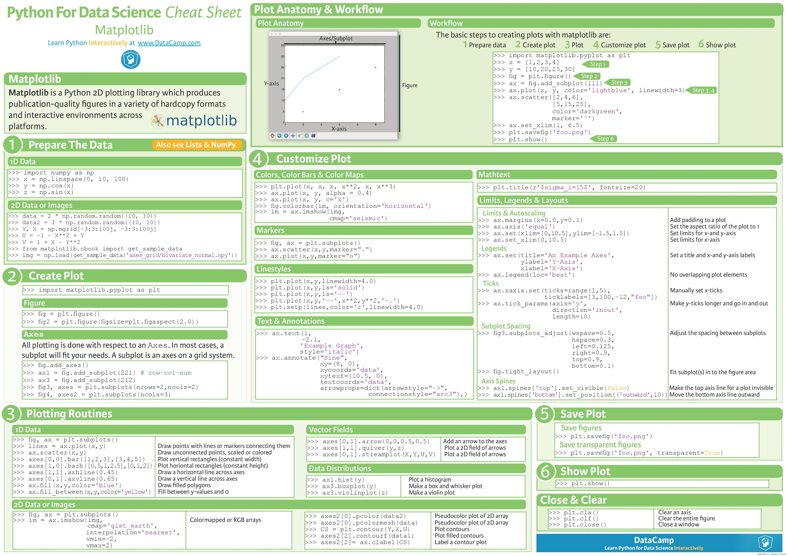
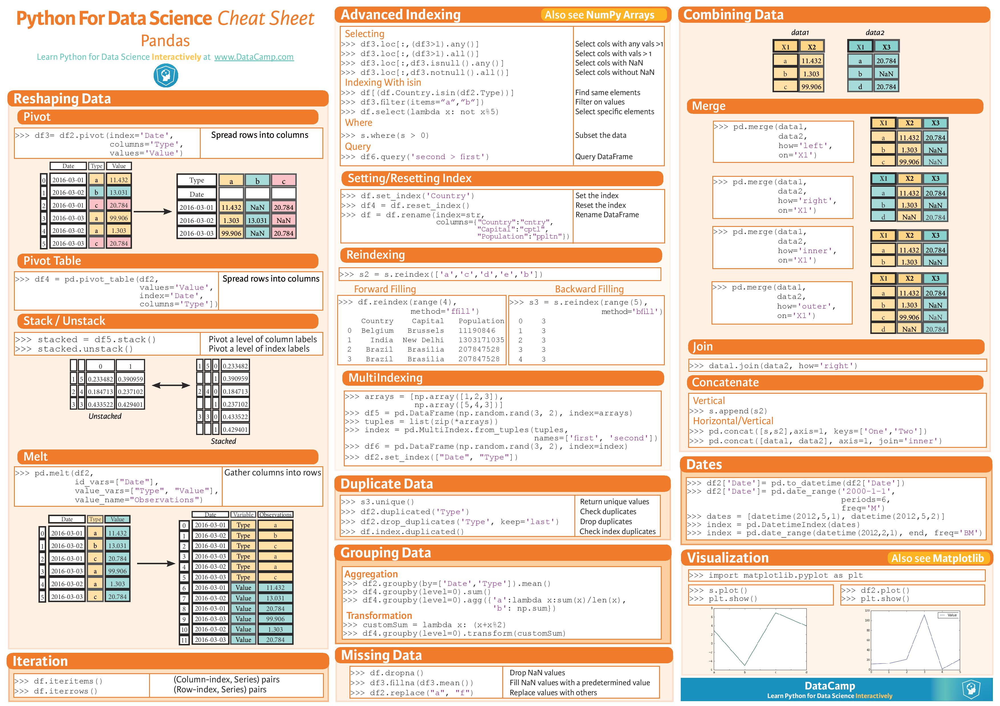

# My Deep Learning Resources

This README is how and where I learn deep learning from the internet. There are many resources out there and normally you could just google it, but I kept the resources that I like or suggest here. I'll constantly update the list here, since I am constantly learning.

## A suggested approach for learning

Learning is a long path of work. When I am learning deep learning, sometimes I just couldn't understand some terminology. The strategy to tackle this problem is to read more regarding to the same topic. Some articles assume you know the knowledge (unfortunately, you are not), and skip the details of it. Therefore I would suggest to read more until you understand it. This approach is somehow similar to the training in supervised learning. More data you feed in the training, better performance you'll attain. The resources listed below have some overlap knowledge, so read fast the part you already know and deep into the one you don't. Enjoy!

Note: I pust some out of date resources in Past Resources, however some of them are still worth check especially for people who are not familiar with some topics.

## Courses

- [DNN] [DeepLearning.ai](https://www.coursera.org/specializations/deep-learning) by Andrew Ng on Coursera. There are total 5 courses which give you great intuition of how neural network works.

- [ML] [Google Machine Learning Crash Course with TensorFlow APIs](https://developers.google.cn/machine-learning/crash-course/)

- [CNN] [CS231n: Convolutional Neural Networks for Visual Recognition](http://cs231n.stanford.edu/2017/syllabus) by Fei-Fei Li, Justin Johnson and Serena Yeung at Stanford - At the time of this post, the course is taught in 2017. If you want to learn the latest course, just google CS231n.

- [NLP] [CS224n: Natural Language Processing with Deep Learning](http://web.stanford.edu/class/cs224n/syllabus.html) by Richard Socher at Stanford

- [NLP] [Deep Learning for Natural Language Processing](https://www.cs.ox.ac.uk/teaching/courses/2016-2017/dl/) - The lecture notes is [here](https://github.com/oxford-cs-deepnlp-2017/lectures).

- [RL] [CS234: Reinforcement Learning](http://web.stanford.edu/class/cs234/index.html) by Emma Brunskill at Stanford - Since David Silver currently is not teaching Reinforcement Learning at UCL, you might wanna take course here instead.

- [RL] [CS 294: Deep Reinforcement Learning](http://rll.berkeley.edu/deeprlcourse/) by Sergey Levine at UC Berkeley

- [RL] [UCL Course on RL](http://www0.cs.ucl.ac.uk/staff/d.silver/web/Teaching.html) by David Silver at UCL - Big giant of reinforcement learning. This course was taught when David Silver is at UCL.

- [Self-driving Car] [MIT 6.S094: Deep Learning for Self-Driving Cars](https://selfdrivingcars.mit.edu/) - YouTube lectures available

## Post

- [2018 Learning List](https://www.leiphone.com/news/201801/pM48Ekleds2b6j5i.html?ulu-rcmd=1_5021df_hot_3_19666c7f4149426ab82ef73c987d5d6c)

- [Deep Learning Specialization by Andrew Ng — 21 Lessons Learned](https://towardsdatascience.com/deep-learning-specialization-by-andrew-ng-21-lessons-learned-15ffaaef627c) - Great review of Andrew's deep learning courses.

- [Computer Vision by Andrew Ng — 11 Lessons Learned](https://towardsdatascience.com/computer-vision-by-andrew-ng-11-lessons-learned-7d05c18a6999) - Another great review of Andrew's deep learning courses.

- [DNN] [Neural Networks, Manifolds, and Topology](http://colah.github.io/posts/2014-03-NN-Manifolds-Topology/)- Under the hood how deep learning works.

- [DNN] [ConvNetJS](https://cs.stanford.edu/people/karpathy/convnetjs/) - Deep learning is like a black box. Let's visualize under the hood and have the intuition.

- [CNN] [Deep Bilateral Learning for Real-Time Image Enhancement](https://groups.csail.mit.edu/graphics/hdrnet/) - Algorithms to enhance image resolution through Convolutional Neural Network.

- [CNN] [A Brief History of CNNs in Image Segmentation: From R-CNN to Mask R-CNN](https://blog.athelas.com/a-brief-history-of-cnns-in-image-segmentation-from-r-cnn-to-mask-r-cnn-34ea83205de4) - Overview of Regional Convolutional Neural Network

- [CNN] [Building powerful image classification models using very little data](https://blog.keras.io/building-powerful-image-classification-models-using-very-little-data.html) - Implementation of transfer learning in Keras.

- [CNN] [UFLDL Tutorial](http://ufldl.stanford.edu/tutorial/StarterCode/) - Great tutorials with Matlab code 

- [LSTM] [Understanding LSTM Networks](http://colah.github.io/posts/2015-08-Understanding-LSTMs/) - The best explanation of Long Short-term Memory.

- [LSTM] [零基础入门深度学习(6) - 长短时记忆网络(LSTM)](https://www.zybuluo.com/hanbingtao/note/581764)

- [RNN] [Attention and Augmented Recurrent Neural Networks](https://distill.pub/2016/augmented-rnns/) - The best explanation of attention mechanism.

- [RNN] [The Unreasonable Effectiveness of Recurrent Neural Networks](https://karpathy.github.io/2015/05/21/rnn-effectiveness/) - Post by Andrej. He explains how recurrent neural network works and demonstrates some experiments.

- [GAN][Fantastic GANs and where to find them](http://guimperarnau.com/blog/2017/03/Fantastic-GANs-and-where-to-find-them) - List and compare different GANs.

- [DEBUG] [Debugging Neural Networks: A Checklist](https://engineering.semantics3.com/debugging-neural-networks-a-checklist-ca52e11151ec)

- [Tutorial] [教程那么多，你……看完了吗？](https://www.jiqizhixin.com/articles/2018-02-07-3)

## Paper and Code

- [arXiv](https://arxiv.org) - Paper.

- [arXiv-Sanity](http://www.arxiv-sanity.com/) - Paper.

- [Gitxiv](http://www.gitxiv.com/) - Source code for paper from arXive.

## Github Repositories (TensorFlow Based)

- [Tutorials] [https://github.com/ageron/handson-ml](https://github.com/ageron/handson-ml) - A series of Jupyter notebooks that walk you through the fundamentals of Machine Learning and Deep Learning in python using Scikit-Learn and TensorFlow.

- [Tutorials] [https://github.com/aymericdamien/TensorFlow-Examples](https://github.com/aymericdamien/TensorFlow-Examples) - TensorFlow tutorial and examples for beginners with latest APIs

- [Tutorials] [https://github.com/Hvass-Labs/TensorFlow-Tutorials](https://github.com/Hvass-Labs/TensorFlow-Tutorials)

- [Tutorials] [https://github.com/nfmcclure/tensorflow_cookbook](https://github.com/nfmcclure/tensorflow_cookbook) - Code for Tensorflow Machine Learning Cookbook.

- [Tutorials][https://github.com/jtoy/awesome-tensorflow](https://github.com/jtoy/awesome-tensorflow) - Awesome TensorFlow

- [Tutorials] [https://github.com/Kulbear/deep-learning-coursera](https://github.com/Kulbear/deep-learning-coursera) - Homework of deep learning courses on Coursera by Andrew Ng.

- [Tutorials] [https://github.com/udacity/deep-learning](https://github.com/udacity/deep-learning) - Repo for Udacity Deep Learning Nanodegree Foundations program.

- [Tutorials] [https://github.com/nlintz/TensorFlow-Tutorials](https://github.com/nlintz/TensorFlow-Tutorials) - Simple tutorials using TensorFlow Framework.

- [Tutorials] [https://github.com/sjchoi86/Tensorflow-101](https://github.com/sjchoi86/Tensorflow-101) - TensorFlow tutorials

- [Tutorials] [https://github.com/pkmital/tensorflow_tutorials](https://github.com/pkmital/tensorflow_tutorials) - From the basics to slightly more interesting applications of TensorFlow

- [Tutorials] [https://github.com/BinRoot/TensorFlow-Book](https://github.com/BinRoot/TensorFlow-Book) - Accompanying source code for Machine Learning with TensorFlow. Refer to the book for step-by-step explanations. http://www.tensorflowbook.com

- [Tutorials] [https://github.com/chiphuyen/stanford-tensorflow-tutorials](https://github.com/chiphuyen/stanford-tensorflow-tutorials) - This repository contains code examples for the Stanford's course: TensorFlow for Deep Learning Research.

- [Tutorials] [https://github.com/vahidk/EffectiveTensorflow](https://github.com/vahidk/EffectiveTensorflow) - TensorFlow tutorials and best practices.

- [RNN] [Neural Machine Translation (seq2seq) Tutorial](https://github.com/tensorflow/nmt) - TensorFlow's official tutorial for sequence to sequence

- [RNN] [https://github.com/udacity/deep-learning/tree/master/seq2seq](https://github.com/udacity/deep-learning/tree/master/seq2seq) - Udacity sequence to sequence tutorials.

- [RNN] [https://github.com/facebookresearch/fastText/](https://github.com/facebookresearch/fastText/) - Facebook Research Library for Fast Text Representation and Classification.

- [RNN] [https://github.com/Currie32/Text-Summarization-with-Amazon-Reviews](https://github.com/Currie32/Text-Summarization-with-Amazon-Reviews) - A seq2seq model that can generate summaries from fine food reviews on Amazon.

- [RNN] [https://github.com/Disiok/poetry-seq2seq](https://github.com/Disiok/poetry-seq2seq) - Chinese Poetry Generation.

- [GAN] [https://github.com/carpedm20/DCGAN-tensorflow](https://github.com/carpedm20/DCGAN-tensorflow) - A tensorflow implementation of "Deep Convolutional Generative Adversarial Networks"

- [RL] [https://github.com/dennybritz/reinforcement-learning](https://github.com/dennybritz/reinforcement-learning)

- [Object Detection] [https://github.com/pjreddie/darknet](https://github.com/pjreddie/darknet)

- [Object Detection] [https://github.com/CharlesShang/FastMaskRCNN](https://github.com/CharlesShang/FastMaskRCNN) - Mask Regional Convolutional Neural Network (TensorFlow)

- [Faster RCNN] [https://github.com/tryolabs/luminoth](https://github.com/tryolabs/luminoth) - Project Luminoth.

- [Faster RCNN] [https://github.com/rbgirshick/py-faster-rcnn](https://github.com/rbgirshick/py-faster-rcnn) - Faster Regional Convolutional Neural Network

- [Mask RCNN] [https://github.com/matterport/Mask_RCNN](https://github.com/matterport/Mask_RCNN)

- [Capsules Net] [https://github.com/naturomics/CapsNet-Tensorflow](https://github.com/naturomics/CapsNet-Tensorflow) - A Tensorflow implementation of CapsNet(Capsules Net) in Hinton's paper Dynamic Routing Between Capsules.

- [Self-driving Car] [https://github.com/udacity/self-driving-car](https://github.com/udacity/self-driving-car) - Udacity self-driving car project

- [Style Transfer] [https://github.com/lengstrom/fast-style-transfer](https://github.com/lengstrom/fast-style-transfer) - Implementation combining [Gatys et al](https://arxiv.org/abs/1508.06576), [Johnson et al](http://cs.stanford.edu/people/jcjohns/eccv16/), and [Ulyanov et al](https://arxiv.org/abs/1607.08022).

- [Style Transfer] [https://github.com/Hvass-Labs/TensorFlow-Tutorials/blob/master/15_Style_Transfer.ipynb](https://github.com/Hvass-Labs/TensorFlow-Tutorials/blob/master/15_Style_Transfer.ipynb) - Implementation of [Gatys et al](https://arxiv.org/abs/1508.06576) with tutorial.

- [Style Transfer] [https://github.com/cysmith/neural-style-tf](https://github.com/cysmith/neural-style-tf) - Implementation of [Gatys et al](http://www.cv-foundation.org/openaccess/content_cvpr_2016/papers/Gatys_Image_Style_Transfer_CVPR_2016_paper.pdf), [Ruder et al](https://arxiv.org/abs/1604.08610), [Gatys et al](https://arxiv.org/abs/1606.05897).

## Github Repositories (Keras Based)

- [Tutorials] [https://github.com/keras-team/keras/tree/master/examples](https://github.com/keras-team/keras/tree/master/examples) - Keras official examples.

- [Tutorials] [https://github.com/PacktPublishing/Deep-Learning-with-Keras](https://github.com/PacktPublishing/Deep-Learning-with-Keras) - Code repository for Deep Learning with Keras published by Packt.

- [CNN] [https://github.com/ypwhs/dogs_vs_cats](https://github.com/ypwhs/dogs_vs_cats) - [Dogs vs Cats](https://www.kaggle.com/c/dogs-vs-cats)

- [RCNN] [https://github.com/broadinstitute/keras-rcnn](https://github.com/broadinstitute/keras-rcnn)

- [RNN] [https://github.com/Kulbear/stock-prediction](https://github.com/Kulbear/stock-prediction)

- [Self-driving Car] [Autonomous Driving using End-to-End Deep Learning: an AirSim tutorial](https://github.com/Microsoft/AutonomousDrivingCookbook/tree/master/AirSimE2EDeepLearning) - Microsoft autonomous driving tutorial.

- [Capsules Net] [https://github.com/XifengGuo/CapsNet-Keras](https://github.com/XifengGuo/CapsNet-Keras)

## Github Repositories (Caffe2 Based)

- [Object Detection] [https://github.com/facebookresearch/Detectron](https://github.com/facebookresearch/Detectron) - FAIR's research platform for object detection research, implementing popular algorithms like Mask R-CNN and RetinaNet.

## Github Repositories (PySpark)

- [https://github.com/nchammas/flintrock](https://github.com/nchammas/flintrock) - How to quickly deploy Spark on Amazon Web Service.

- [https://github.com/jadianes/spark-py-notebooks](https://github.com/jadianes/spark-py-notebooks) - Apache Spark & Python (pySpark) tutorials for Big Data Analysis and Machine Learning as IPython / Jupyter notebooks

- [https://github.com/Azure/mmlspark](https://github.com/Azure/mmlspark) - Microsoft Machine Learning for Apache Spark

- [https://github.com/lensacom/sparkit-learn](https://github.com/lensacom/sparkit-learn) - PySpark + Scikit-learn = Sparkit-learn

## Github Repositories (Others)

- [Bayesian Optimization] [https://github.com/fmfn/BayesianOptimization](https://github.com/fmfn/BayesianOptimization)

## Deep Learning Framework

- [TensorFlow] [TensorFlow Tutorials](https://www.tensorflow.org/tutorials/) - Steps by steps teach you how to implement TensorFlow on some tasks. This is the starting point of learning TensorFlow.

- [TensorFlow] [CS 20: Tensorflow for Deep Learning Research](http://web.stanford.edu/class/cs20si/index.html) by Chip Huyen at Stanford - TensorFlow course for Stanford students

- [DialogFlow](https://dialogflow.com/docs/getting-started/basics)

- [MXNet](https://mxnet.incubator.apache.org/tutorials/index.html)

- [Deep Learning for Java](https://deeplearning4j.org/tutorials)

## Blog

- [機器之心](https://www.jiqizhixin.com/) - The best media for Machine Learning (in Chinese)

- [Toward Data Science](https://towardsdatascience.com/) - Great post regarding data science on Medium.

- [Colah's blog](http://colah.github.io/) - The best blog to give you the intuition of deep learning. New post will be located on [Distill](https://distill.pub/).

- [Distill](https://distill.pub/) - The best blog to visualize and understand deep learning.

- [Deep Learning Monitor](https://deeplearn.org/) - Hot topics include tweets, papers, and others.

- [Google Research Blog](https://research.googleblog.com/) - Show the latest research of Google.

## Books

- [Deep Learning Book](http://www.deeplearningbook.org/) - Fundamental knowledge of deep learning, also known as a bible in deep learning. As a bible, it also means it is hard to read.

## Kaggle

Kaggle Past Solutions --- [http://ndres.me/kaggle-past-solutions/](http://ndres.me/kaggle-past-solutions/)

Awesome Kaggle --- [https://github.com/krishnakalyan3/awesome-kaggle](https://github.com/krishnakalyan3/awesome-kaggle)

[Web Traffic Time Series Forecasting](https://www.kaggle.com/c/web-traffic-time-series-forecasting)

- [https://github.com/Arturus/kaggle-web-traffic](https://github.com/Arturus/kaggle-web-traffic) - 1st place.

- [https://github.com/jfpuget/Kaggle](https://github.com/jfpuget/Kaggle) - 2nd place.

[Carvana Image Masking Challenge](https://www.kaggle.com/c/carvana-image-masking-challenge)

- [https://github.com/ternaus/TernausNet](https://github.com/ternaus/TernausNet) - 1st place.

[Amazon Fine Food Reviews](https://www.kaggle.com/snap/amazon-fine-food-reviews)

- [https://github.com/Currie32/Text-Summarization-with-Amazon-Reviews](https://github.com/Currie32/Text-Summarization-with-Amazon-Reviews)

[New York City Taxi Trip Duration](https://www.kaggle.com/c/nyc-taxi-trip-duration)

- [https://github.com/LightR0/New-York-City-Taxi-Trip-Duration](https://github.com/LightR0/New-York-City-Taxi-Trip-Duration)

- [https://github.com/mk9440/New-York-City-Taxi-Trip-Duration](https://github.com/mk9440/New-York-City-Taxi-Trip-Duration)

- [https://github.com/Currie32/NYC-Taxi-Trip-Duration](https://github.com/Currie32/NYC-Taxi-Trip-Duration)

- [https://github.com/kqdmqx/kaggle-New-York-City-Taxi-Trip-Duration](https://github.com/kqdmqx/kaggle-New-York-City-Taxi-Trip-Duration)

[Telstra Network Disruptions](https://www.kaggle.com/c/telstra-recruiting-network)

- [https://github.com/aarshayj/Kaggle](https://github.com/aarshayj/Kaggle)

[Loan Default Prediction](https://www.kaggle.com/c/loan-default-prediction)

- [https://github.com/BernardOng/kaggle-consumer-credit-default](https://github.com/BernardOng/kaggle-consumer-credit-default)

## Modeling

- [Ensemble Models](http://blog.kaggle.com/2017/06/15/stacking-made-easy-an-introduction-to-stacknet-by-competitions-grandmaster-marios-michailidis-kazanova/)

## Trend

[Computer Vision trend in 2017](https://blog.goodaudience.com/a-year-in-computer-vision-part-1-of-4-eaeb040b6f46)

[Natural Language Processing trend in 2017](https://tryolabs.com/blog/2017/12/12/deep-learning-for-nlp-advancements-and-trends-in-2017/)

[The Google Brain Team — Looking Back on 2017](https://research.googleblog.com/2018/01/the-google-brain-team-looking-back-on.html)

## Dataset

- [UCI Dataset](https://archive.ics.uci.edu/ml/datasets.html)

- [Image] [IMAGE NET](http://www.image-net.org/) - With 14,197,122 images, 21841 synsets indexed

- [Image] [The CIFAR-10 and CIFAR-100](https://www.cs.toronto.edu/~kriz/cifar.html) - The CIFAR-10 and CIFAR-100 are labeled subsets of the 80 million tiny images dataset.

- [Object Detection] [http://cocodataset.org/#home](http://cocodataset.org/#home) - COCO is a large-scale object detection, segmentation, and captioning dataset. 

- [Object Detection] [PASCAL-Context](https://www.cs.stanford.edu/~roozbeh/pascal-context/) - Training and validation contains 10,103 images while testing contains 9,637 images.

- [Object Detection] [KITTI Vision Benchmark Suite](http://www.cvlibs.net/datasets/kitti/)

- [AI Challenger](https://challenger.ai/datasets)

- [Others] [Creative Commons license 0](https://creativecommons.org/use-remix/)

## Pre-trained Models

- [Image] [http://www.vlfeat.org/matconvnet/models/](http://www.vlfeat.org/matconvnet/models/) - AlexNet, VGG16, VGG19, GoogleNet, ResNet on image net, fast Regional Convolutional Neural Network on pascal (matlab file)

- [Image] [https://pjreddie.com/darknet/imagenet/](https://pjreddie.com/darknet/imagenet/) - Models on image net

- [word2vec] [English word vectors](https://fasttext.cc/) - Pre-trained word to vector models by Facebook.

- [[word2vec]] [https://github.com/3Top/word2vec-api](https://github.com/3Top/word2vec-api)

- [[word2vec]] [https://github.com/Kyubyong/wordvectors](https://github.com/Kyubyong/wordvectors)

## AI Companies

- [2017 Synced Machine Intelligence Awards](https://www.jiqizhixin.com/articles/synced-machineintelligence-awards01)

- [机器之心百家影响人工智能未来的公司榜单](https://github.com/jiqizhixin/AI00)

## Spark (especially PySpark)

- [https://github.com/drabastomek](https://github.com/drabastomek) - Learning PySpark book with its source code.

## Real World Examples 

- [Google Cloud Architecture Incredible On Pertaining To Running Distributed TensorFlow Compute Engine Solutions](http://donatz.info/google-cloud-architecture/google-cloud-architecture-incredible-on-pertaining-to-running-distributed-tensorflow-compute-engine-solutions-26/)

- [EyeEm's Architecture](http://highscalability.com/blog/2017/10/23/one-model-at-a-time-integrating-and-running-deep-learning-mo.html)

## My Blog

[Programming Notes](https://medium.com/tinghaochen) - I post some notes regarding to Python.

[Machine Learning Notes](https://medium.com/machine-learning-algorithms) - My understanding of machine learning with simple descriptions

## Contact Me 

LinkedIn: [https://www.linkedin.com/in/chentinghao/](https://www.linkedin.com/in/chentinghao/)

Medium: [https://medium.com/@tinghaochen](https://medium.com/@tinghaochen)

## Python for Data Science Cheat Sheet

source: [DataCamp](https://www.datacamp.com/community/data-science-cheatsheets)

### Python Basics

### Python Bokeh

### Python Importing Data

### Python Jupyter Notebook

### Python Keras

### Python Matploblib

### Python NumPy

### Python Pandas

### Python PySpark

### Python Scikit-learn

### Python SciPy

### Python Seaborn

### R Data Table

### R Ridyverse for Begineers

### R Xts

